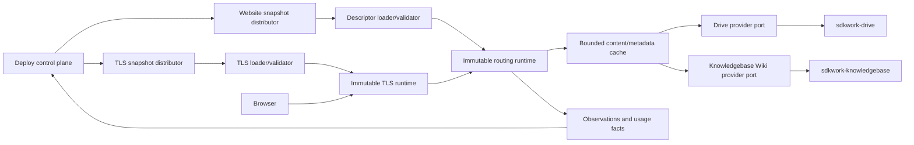
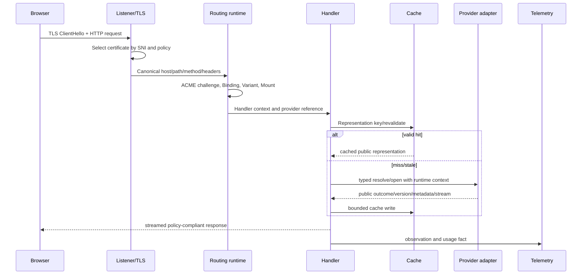

# Cloud Site Delivery Data-Plane Architecture

Status: proposed
Owner: SDKWork Web Server maintainers
Updated: 2026-07-21
Requirement: REQ-2026-0060
Decision: ADR-20260721-compiled-website-runtime-descriptor
Specs: ARCHITECTURE_DECISION_SPEC.md, API_SPEC.md, SDK_SPEC.md,
APP_SDK_INTEGRATION_SPEC.md, CONFIG_SPEC.md, DEPLOYMENT_SPEC.md, NGINX_SPEC.md,
SECURITY_SPEC.md, PRIVACY_SPEC.md, PERFORMANCE_SPEC.md, OBSERVABILITY_SPEC.md, TEST_SPEC.md

## 1. Runtime Boundary



Control-plane connectivity is not on the request hot path after a valid snapshot is loaded.
Provider resolution is on the origin path and therefore uses bounded timeouts, concurrency,
circuit breaking, caching, and explicit stale behavior.

The current writable Web app-api and `web_site`, `web_domain`, `web_deployment`, and
`web_certificate` tables are pre-cutover control-plane debt, not part of this target data plane.
Public activation is blocked until Deploy is the single writer, state is shadow-compared and
reconciled, Web write routes are disabled/retired, and rollback cannot reactivate dual writers.

## 2. Snapshot Model

### 2.1 Website Snapshot

The loader validates:

- supported schema major/minor and compiler compatibility;
- canonical payload SHA-256 and distribution authenticity;
- maximum serialized bytes and maximum counts per collection;
- unique stable identities and tenant-safe ownership hash;
- Binding host/path uniqueness, wildcard validity, and redirect acyclicity;
- one default Variant and reachable rule targets;
- Mount prefix uniqueness, root/alias translation, and handler/resource compatibility;
- stable Site-local Resource identity plus opaque provider resource identity; diagnostic provider
  Space/root fields cannot retarget or authorize the provider;
- safe index/fallback/header/MIME/cache/security/observability values;
- absence of secrets, URLs, object keys, DB strings, control characters, and executable rules.

The staged runtime builds bounded indexes for exact host, registered wildcard suffix, Binding path
prefixes, Variants/rules, Mount path prefixes, and stable ID lookup. Request complexity is bounded by
host/path depth and the selected Site, not by all tenants.

### 2.2 TLS Snapshot

The TLS loader validates node assignment, secret authorization, encrypted transport, complete
certificate/key bundle, key match, chain, names, validity, algorithm, TLS policy, and snapshot
version. SNI maps are immutable and swapped independently from website routing maps.

### 2.3 Activation

```text
received -> validating -> staged -> probed -> active
                  |          |         |
                  +----------+---------+-> rejected
```

Only `active` changes the current pointer. Rejection retains the previous snapshot and reports a
bounded reason. Snapshot retention is bounded but preserves the configured rollback depth.

## 3. Request Pipeline



### 3.1 Canonicalization

SNI and Host share IDNA/case/trailing-dot normalization while remaining separate protocol fields.
Path handling preserves the canonical/raw dual representation required by the existing URI ADR.
Routing rejects encoded `/` or `\\`, dot segments after applicable decoding, null/control bytes,
overlong segments, invalid percent encoding, and prefix confusion. Query does not select a file path.

### 3.2 Binding Lookup

- exact hostname first;
- one explicitly registered wildcard suffix with a label boundary;
- longest segment-aware Binding `pathPrefix`;
- deterministic rejection if descriptor validation somehow did not eliminate ambiguity.

Redirect bindings use validated target identities, fixed redirect policy, bounded hop count, and safe
path/query preservation. They never reflect an arbitrary Host.

### 3.3 Variant Selection

The runtime records `variant_reason` as forced, preference, path, client-hint, user-agent, bot,
binding-default, or site-default. Signed preference cookies are validated before use. Client Hints
are trusted only over configured secure contexts and included in the correct cache `Vary` policy.
User-Agent classification uses a versioned bounded parser and is never a permission input.

### 3.4 Mount Translation

For `ROOT`, append the normalized request remainder according to root semantics. For `ALIAS`, replace
the matched URL prefix with `resourceSubpath`. Both results are provider-relative and cannot ascend
above the provider root. Empty and trailing-slash paths use bounded ordered index files. Directory
redirects preserve the canonical Binding origin.

These Mount modes are URL translation, not Drive source selection. `SPACE_ROOT` and `FOLDER` are
Drive WebsiteRoot selector modes already resolved behind `providerResourceUuid`. The translated path
always starts at provider `/`; Web Server neither reads a Drive node path nor combines Mount
`resourceSubpath` with diagnostic Space/folder identity.

## 4. Handler Architecture

### 4.1 STATIC

- resolve metadata before selecting MIME/cache/range behavior;
- support GET/HEAD and valid range behavior within configured limits;
- use ETags according to the provider version contract;
- stream bodies and avoid full buffering;
- reject directories unless an index resolves; no implicit listing;
- apply safe download disposition for unknown or active content types;
- deny dotfiles, backups, source maps, and reserved paths through a compiled bounded policy.

### 4.2 SPA

SPA first executes STATIC. Fallback is eligible only for navigation-like GET/HEAD requests accepted
by policy, remains inside the resource, and uses the fallback file's version/cache identity. Missing
assets, invalid paths, denied files, provider errors, and methods do not silently become the shell.

### 4.3 WIKI

The adapter asks Knowledgebase to resolve the public Wiki route because page state, visibility,
redirects, navigation, locale, render, search, and SEO belong there. The runtime may cache a typed
public representation by publication/page/source/render version. It does not open Markdown directly
and independently decide it is public.

Wiki HTML is sanitized under a versioned renderer policy. Remote embeds, active SVG, raw HTML,
scripts, inline event handlers, unsafe URL schemes, oversized data URLs, and cross-root asset links
are denied or transformed by policy. Search uses provider-side bounded pagination.

## 5. Provider Port Contracts

Conceptual operations, with final names owned by each provider contract:

```text
validateResource(reference, runtimeContext) -> eligibility/capabilities
resolvePath(reference, normalizedPath, conditions, runtimeContext) -> metadata/public version
openContent(reference, normalizedPath, range, conditions, runtimeContext) -> bounded stream
resolveWikiRoute(reference, route, locale, conditions, runtimeContext) -> public representation
searchWiki(reference, query, cursor, pageSize, runtimeContext) -> paginated public results
subscribeResourceEvents(checkpoint, runtimeContext) -> idempotent versioned events
```

For Drive, `reference` identifies one opaque WebsiteRoot whose owner validates Website Space type,
`SPACE_ROOT`/`FOLDER`, reserved namespace, current content mode, and generation. For Knowledgebase,
it identifies the one canonical WikiPublication; validation requires ACTIVE for public service.
Multiple Site Resources may reference the same provider UUID, so provider identity alone is never a
complete route, authorization, cache, circuit, or usage key.

The runtime context carries authenticated service identity, tenant/resource scope, trace, deadline,
and purpose. It does not accept tenant scope from a public header. Provider errors distinguish
not-found/not-public, not-modified, invalid path, revoked resource, rate limit, transient unavailable,
and contract mismatch while public responses remain non-disclosing.

## 6. SDK Integration Boundary

Cloud adapters consume application-root declared `sdkwork-drive-internal-sdk` and
`sdkwork-knowledgebase-internal-sdk` dependencies or an approved server facade. SDK clients are
constructed in bootstrap after runtime URLs and credentials
are resolved, receive the approved shared TokenManager/service context, and are injected behind
provider ports. Business handlers do not assemble raw URLs or auth headers.
Provider endpoints and service credentials are runtime configuration, never descriptor fields.
The Web Server application/component manifests must declare these SDK and event dependencies before
the WIKI/STATIC provider implementation can be called integrated.

Same-process standalone composition may inject equivalent typed Rust service implementations. Both
profiles execute the same provider contract suite. Web Server does not generate Drive or
Knowledgebase operations into its own SDK family.

## 7. Cache Architecture

Layers may include request-local metadata, process memory, node disk, and approved shared/edge cache.
Every layer uses this complete identity:

```text
siteRevisionPolicyGeneration
+ tenantScopeHash
+ bindingUuid + variantUuid + mountUuid
+ resourceUuid + providerGeneration
+ normalizedProviderPathOrWikiRoute
+ pagePublicVersionOrStaticContentVersion
+ renderer/template/locale/encoding representation
```

Raw Host/path alone is not a cross-tenant key. Entries record public eligibility evidence and
expiry. Public-to-private/revoked/delete events evict with highest priority; uncertain state is
revalidated before serving. Stale-while-revalidate never converts unknown/private content to public.

Single-flight keys and permits are bounded without unbounded waiters. Admission, maximum entry/body
size, total bytes, TTL, negative TTL, eviction, disk cleanup, corruption recovery, and shutdown
behavior are typed configuration.

## 8. Provider Event Processing

Drive WebsiteRoot events and Knowledgebase events have owner AsyncAPI authorities. Knowledgebase
delivery consumes `knowledgebase.wiki.provider.changed.v1`,
`knowledgebase.wiki.route.changed.v1`, `knowledgebase.wiki.route.revoked.v1`,
`knowledgebase.wiki.navigation.changed.v1`, and `knowledgebase.wiki.search.changed.v1` directly;
Deploy is not an ordinary content-event relay.

Events contain provider/resource/path identity, operation, page/static public version,
provider/navigation/search generation, sequence/checkpoint, and time; no body, token, object key,
or private URL. Processing is idempotent. Moves invalidate old/new paths. `ATOMIC_SYNC` root switch
advances a provider generation atomically. Private Wiki processing advances no public cache
version, while ordinary page updates invalidate only affected routes plus necessary
navigation/search snapshots.

On sequence gap, checkpoint loss, incompatible version, or excessive lag, mark the affected resource
uncertain, stop trusting freshness-only cache, reconcile through provider metadata, then resume from
a durable checkpoint. Events improve freshness; provider revalidation is the correctness backstop.

## 9. TLS Runtime Separation

In cloud mode the certificate worker is an execution adapter:

1. receive a typed, fenced order/challenge/distribution job from Deploy;
2. resolve only authorized secret references through injected providers;
3. perform bounded ACME/DNS/TLS work;
4. return redacted state/fingerprint/evidence;
5. stage an immutable node-specific certificate version;
6. validate and hot-swap the SNI map;
7. expose the actual served fingerprint through observation.

HTTP-01 uses an exact active token map checked before Site routing. It cannot expose an ACME webroot
directory. DNS credentials never reach the request runtime. Failed load/probe leaves the prior valid
certificate active.

## 10. Runtime State And Persistence

The cloud business source is Deploy `deploy_*`. Web Server may persist:

- immutable received snapshots by revision/hash;
- node-local current/previous pointers;
- durable event checkpoints and bounded cache metadata;
- desired/observed projections needed for restart/reconciliation;
- runtime audit and operation evidence owned by Web Server.

It must not accept independent cloud writes that create a Site/domain/certificate truth conflicting
with Deploy. Existing `web_site`, `web_domain`, `web_deployment`, and `web_certificate` follow the
cross-repository migration. Runtime files use canonical protected directories and atomic
write/fsync/rename semantics where applicable.
The same retirement applies to overlapping Web app-api Site/Domain/Deployment/Certificate write
routes. Read-only runtime observation APIs may remain only after their ownership and names no
longer imply control-plane authority.

## 11. Concurrency And Bounds

Separate admission pools apply to connections, handshakes, descriptor load, TLS load, provider
metadata, origin streams, Wiki render/search, cache writes, invalidation, usage spool, and probes.
Slow provider work cannot consume all request executor capacity. Deadlines propagate and
cancellation releases permits and streams.

Descriptor limits cover assigned Sites/node, hosts, Bindings, Variants, rules, Mounts, resources,
policies, headers, bytes, and retained revisions. TLS limits cover names, SANs, versions, material
bytes, concurrent activation, and retained contexts. Runtime safety ceilings cannot be raised by a
tenant plan.

## 12. Observability And Health

Readiness is listener/assignment aware. A node is not ready for assigned traffic when desired
website/TLS snapshots are missing, invalid, expired, or incompatible. Provider degradation may mark
affected origins without taking unrelated cached Sites out of service.

Structured events cover snapshot received/rejected/staged/activated/rollback, TLS loaded/probed,
routing outcome, provider/circuit, cache, event gap/reconciliation, admission, usage spool, and
graceful lifecycle. Logs use stable IDs/reason codes; metrics use bounded labels.

Observations sent to Deploy include desired/observed hashes/revisions, timestamps, probe status,
capacity, lag, and bounded errors. Raw descriptors, keys, content, cookies, auth headers, and
provider payloads are excluded.

## 13. Failure And Recovery

| Scenario | Recovery |
| --- | --- |
| Corrupt/incompatible website snapshot | reject, retain current, report reason |
| Corrupt/incompatible TLS snapshot | reject, retain valid current certificate |
| Process restart | load verified current snapshots, rebuild indexes, reconcile desired state |
| Deploy unreachable | serve current; spool bounded observations; management unavailable |
| Provider transient failure | timeout/circuit, allowed stale or explicit 5xx; no visibility inference |
| Event consumer failure | checkpoint restart; uncertainty and read-through reconcile |
| Cache corruption | evict/rebuild; never serve unverifiable bytes |
| Node version skew | compatibility gate; exclude incompatible node from quorum/readiness |
| Usage sink failure | bounded durable spool/replay; alert before capacity |

## 14. Deployment Topology

Cloud Web Nodes are stateless with respect to business authority and horizontally scalable. They use
managed snapshot distribution, secret delivery, provider endpoints, cache volumes where selected,
health probes, graceful drain, and region-specific capacity. Public load balancers/CDNs preserve
validated Host/SNI/client information under trusted proxy policy.

Standalone can compose Deploy/source/provider/runtime in one unit or load an approved local
descriptor, but it uses the same routing/provider/TLS behavior. SQLite/local secret/file capability
differences are explicit and do not claim cloud multi-node semantics.

## 15. Verification Matrix

| Boundary | Required evidence |
| --- | --- |
| Descriptor | schema, canonical hash, compatibility, bounds, signature, atomic swap, golden/fuzz |
| Routing | Host/SNI/IDNA/wildcard/path/redirect/Variant/Mount property and integration tests |
| Static/SPA | Space-root/folder-root provider parity, Mount-vs-provider-root separation, index, fallback, MIME, range, conditional, traversal, streaming, cache behavior |
| Wiki | canonical publication, inactive/non-public behavior, multi-Site reuse, state/visibility, sanitize, navigation/search/assets/redirect/reserved-root tests |
| Control-plane cutover | one Deploy writer, Web write-route/table authority absent, shadow comparison, rollback cannot restore dual writers |
| Wiki realtime | exact AsyncAPI compatibility, route-scoped page versions, provider generation, priority revocation, gap/replay/reconcile, p95/p99 evidence |
| Provider | typed SDK/service port, auth scope, timeouts, events, outage, contract parity |
| TLS | HTTP-01 precedence, ACME execution, distribution, hot swap, SNI probe, last-valid retention |
| Security/privacy | tenant/cache isolation, poisoning, secrets, non-disclosure, retention |
| Reliability | control-plane/provider/event outage, restart, drift, upgrade, rollback |
| Performance | latency, throughput, memory, many domains/Sites, invalidation storm, soak |
| Commercial evidence | usage dedupe/spool/replay/reconciliation and admin observations |

Implementation is not complete merely because a descriptor parses or a local file can be served.
Evidence must demonstrate the externally observed Host/path/content/certificate and the exact
desired/observed runtime state.
