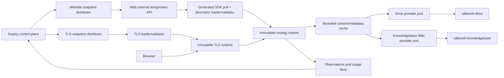
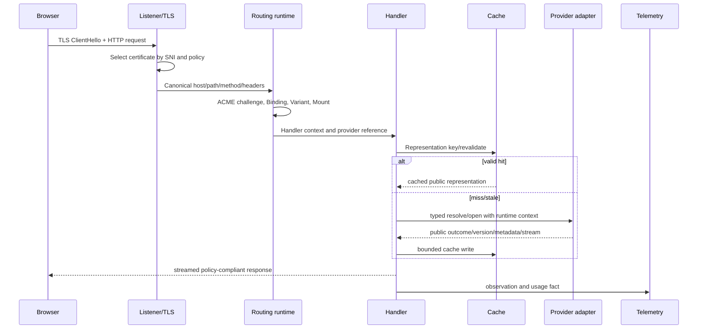

# Cloud Site Delivery Data-Plane Architecture

Status: in-progress
Owner: SDKWork Web Server maintainers
Updated: 2026-07-23
Requirement: REQ-2026-0060
Decision: ADR-20260721-compiled-website-runtime-descriptor
Specs: ARCHITECTURE_DECISION_SPEC.md, API_SPEC.md, SDK_SPEC.md,
APP_SDK_INTEGRATION_SPEC.md, CONFIG_SPEC.md, DEPLOYMENT_SPEC.md, NGINX_SPEC.md,
SECURITY_SPEC.md, PRIVACY_SPEC.md, PERFORMANCE_SPEC.md, OBSERVABILITY_SPEC.md, TEST_SPEC.md

## 1. Runtime Boundary



Control-plane connectivity is not on the request hot path after a valid snapshot is loaded.
Provider resolution is on the origin path and therefore uses bounded timeouts, concurrency,
circuit breaking, caching, and explicit stale behavior.

The writable Web app-api and `web_site`, `web_domain`, `web_deployment`, and `web_certificate`
tables belong only to the explicit standalone local-management profile. `cloud.production` starts
only the Website Edge Runtime with management composition disabled and accepts Deploy-owned
immutable assignments. Standalone records are never imported, shadow-written, or treated as cloud
authority.

### 1.1 Implemented Runtime Contract Slice

`crates/sdkwork-webserver-core/src/website_runtime/` now owns the Web Node consumer model, bounded
loader, canonical hash verification, semantic validation, and immutable request-routing indexes for
`sdkwork.website-runtime.v1`. The supported wire shape is
`specs/sdkwork.website-runtime.descriptor.schema.json`; the descriptor carries Site-local IDs,
opaque provider references, structured policies, and hard-bounded counts only.

The compiled selector performs canonical Host/path normalization, exact before wildcard Host,
longest segment-aware Binding and Mount selection, forced/preference/path/client/default Variant
precedence, Binding-relative routing, `ROOT`/`ALIAS` translation, structured redirects, and
fail-closed denied-path handling. It performs no SQL, HTTP, SDK, filesystem, object-store, or secret
lookup. Provider resolution remains a separate injected port. The node-scoped
`sdkwork.website-runtime-set.v1` registry now compiles every Site descriptor and all cross-Site
Host/path indexes before a serialized control-plane writer swaps one immutable read pointer; a
failed or wrong-node/environment candidate leaves the current set untouched, and exactly one prior
complete in-memory set is retained for rollback. A strictly increasing JSON-safe generation per
node/environment rejects delayed older candidates and same-generation hash conflicts, including
replay after rollback.

`crates/sdkwork-webserver-core/src/tls_runtime/` independently implements the node-scoped
`sdkwork.tls-runtime.v1` assignment contract, canonical hash verification, bounded TLS/ALPN policy,
strictly increasing JSON-safe generation fencing, raw key-material rejection, and immutable
exact/wildcard SNI indexes. The standalone gateway now
consumes this contract for a listener explicitly marked `tlsRuntime: assignment`. Its initial
file-provider adapter accepts only `file:<opaque-version-id>`, confines canonical material paths to
a protected root, parses bounded full-chain/key PEM, and validates leaf SAN, current and declared
validity, expected SHA-256, and key match. It builds a complete Rustls SNI context off the accept
path, enforces the snapshot TLS version range and listener ALPN compatibility, then atomically
reloads new handshakes while existing connections retain the prior context. Invalid updates retain
last-known-good, and staging/production native TLS uses independent A/B snapshot recovery. KMS,
Vault, and CSI adapters can implement the same material-provider boundary without changing the
snapshot or request path; their authorization/decryption contracts remain deployment work.

## 2. Snapshot Model

### 2.1 Website Snapshot

Deploy produces two nested immutable contracts: one `sdkwork.website-runtime.v1` descriptor per
Site revision and one `sdkwork.website-runtime-set.v1` node/environment assignment containing a
stable `siteUuid`-ordered collection of those complete descriptors. The set has its own canonical
hash, strictly increasing generation, and hard 64 MiB/10,000-Site ceilings. An empty assigned set
is valid and ready, with no Site route, so removing the last assignment does not require an invalid
or absent runtime state.

The loader validates:

- supported schema major/minor and compiler compatibility;
- canonical payload SHA-256 and distribution authenticity;
- maximum serialized bytes and maximum counts per collection;
- unique stable identities and tenant-safe ownership hash;
- Binding host/path uniqueness, wildcard validity, and redirect acyclicity;
- one default Variant and reachable rule targets;
- Mount prefix uniqueness, root/alias translation, and handler/resource compatibility;
- stable Site-local Resource identity plus opaque provider resource identity; diagnostic provider
  Space/root fields cannot retarget or authorize the provider;
- safe index/fallback/header/MIME/cache/security/observability values;
- absence of secrets, URLs, object keys, DB strings, control characters, and executable rules.

The staged runtime builds bounded indexes for exact host, registered wildcard suffix, Binding path
prefixes, Variants/rules, Mount path prefixes, and stable ID lookup. Request complexity is bounded by
host/path depth and the selected Site, not by all tenants.

The v1 canonical payload hash excludes `descriptorSha256`, recursively orders JSON object keys, and
preserves array order. Producer collections whose order has no runtime meaning must be sorted by
stable identifier; meaningful ordered arrays such as index-file preference retain authored order.

### 2.2 TLS Snapshot

The target TLS loader validates node assignment, secret authorization, encrypted transport, complete
certificate/key bundle, key match, chain, names, validity, algorithm, TLS policy, and snapshot
version. SNI maps are immutable and swapped independently from website routing maps.

The implemented consumer validates node-scoped assignment metadata, opaque material references,
expected fingerprints, canonical SNI ownership, validity metadata, TLS version/ALPN policy, schema,
hash, bounds, protected file-provider authorization, certificate/key evidence, and atomic Rustls
activation. Encrypted control-plane transport, non-file secret providers, Deploy distribution and
served observations remain outside this node-local adapter.

### 2.3 Activation

```text
RECEIVED -> VALIDATED -> isolated node-local HEAD probe -> STAGED -> ACTIVE
     |           |                    |            |          |
     +-----------+--------------------+------------+----------+-> REJECTED
```

Only `ACTIVE` changes the current pointer. Rejection retains the previous snapshot and reports a
bounded reason. The implemented website registry serializes activation/rollback writers while
request readers load one lock-free immutable pointer. It enforces node/environment scope,
deduplicates unchanged hashes, rejects stale generations and same-generation hash conflicts, and
retains exactly one previous complete set; rollback consumes that one generation without lowering
the replay barrier. The standalone gateway also persists the activated complete runtime-set in
node-local A/B slots, recompiles both slots at restart, selects the highest valid generation across
source and recovery state, and rejects same-generation hash conflicts or node/environment scope
mismatches. Staging and production require an explicit protected recovery directory.
Authenticated distribution is implemented end to end through the application-ingress Web Internal
API and its generated Rust SDK. A Web Node conditionally pulls by environment/generation/hash,
validates node/environment/hash identity and Provider resources, then runs bounded `HEAD` requests
against a candidate-only registry before writing the recovery slot. The probe covers every Binding
and every reachable selectable device Variant and uses `WebsiteProviderPurpose::Activation`; a
failed candidate reports `ACTIVATION_PROBE_FAILED` and cannot replace the live or recoverable
last-known-good runtime-set. Only a successful probe is durably staged and atomically activated.
The Node records resumable `RECEIVED`, `VALIDATED`, `STAGED`, `ACTIVE`, or terminal `REJECTED`
observations. Deploy publishes assignments and reads the latest observation through the generated
Web Internal SDK, persists immutable per-target evidence, and transactionally advances
`deploy_site.current_revision_id` only after every frozen target reports the exact assignment as
`ACTIVE`; partial, stale, mismatched, or `REJECTED` evidence cannot advance it. Detached source
attestation where required, external public-domain multi-vantage probes, production drift
dashboards/alerts, Deploy TLS assignment distribution/observation, and public served-fingerprint
convergence remain independent release work. The node-local
probe proves candidate route/provider resolvability on one Node; it is not public DNS, TLS, CDN, or
Internet reachability evidence.

## 3. Request Pipeline



The production Kubernetes baseline currently terminates public TLS at the reviewed load
balancer/CDN and forwards HTTP/1 to the private `8080` Service assigned to exactly one tenant
fleet. Native node-scoped Rustls hot activation is implemented and available through the separate
native TLS config profile, but the authored Kubernetes baseline does not enable it until Deploy
publishes TLS assignments, mounts authorized versioned material, and records served-fingerprint
convergence. The ingress maps every platform/custom domain to that domain's tenant fleet
Service before the runtime performs Host, Binding, device Variant, Mount, and resource selection.
For the external-termination baseline, deployment rendering requires the direct ingress peer
CIDRs, inserts them into an immutable per-Node listener ConfigMap, and runs the real config compiler
before output. A cleartext
listener uses forwarded scheme only when the immediate peer is trusted and
`X-Forwarded-Proto` has one exact `http` or `https` value. Duplicate, comma-chained, non-text,
whitespace-padded, invalid, or oversized values from a trusted peer return `400`; values from an
untrusted peer are ignored. Native TLS is always HTTPS. Website `forceHttps`, reverse-proxy
`X-Forwarded-Proto`, and access logs consume this single resolved request scheme.

### 3.1 Canonicalization

SNI and Host share IDNA/case/trailing-dot normalization while remaining separate protocol fields.
Path handling preserves the canonical/raw dual representation required by the existing URI ADR.
Routing rejects encoded `/` or `\\`, dot segments after applicable decoding, null/control bytes,
overlong segments, invalid percent encoding, and prefix confusion. Query does not select a file path.

### 3.2 Binding Lookup

- exact hostname first;
- one explicitly registered wildcard suffix with a label boundary;
- longest segment-aware Binding `pathPrefix`;
- deterministic rejection if descriptor validation somehow did not eliminate ambiguity.

Redirect bindings use validated target identities, fixed redirect policy, bounded hop count, and safe
path/query preservation. They never reflect an arbitrary Host.

### 3.3 Variant Selection

The runtime records `variant_reason` as forced, preference, path, client-hint, user-agent, bot,
binding-default, or site-default. Signed preference cookies are validated before use. Client Hints
are trusted only over configured secure contexts and included in the correct cache `Vary` policy.
User-Agent classification uses a versioned bounded parser and is never a permission input.

### 3.4 Mount Translation

For `ROOT`, append the normalized request remainder according to root semantics. For `ALIAS`, replace
the matched URL prefix with `resourceSubpath`. Both results are provider-relative and cannot ascend
above the provider root. Empty and trailing-slash paths use bounded ordered index files. Directory
redirects preserve the canonical Binding origin.

These Mount modes are URL translation, not Drive source selection. `SPACE_ROOT` and `FOLDER` are
Drive WebsiteRoot selector modes already resolved behind `providerResourceUuid`. The translated path
always starts at provider `/`; Web Server neither reads a Drive node path nor combines Mount
`resourceSubpath` with diagnostic Space/folder identity.

## 4. Handler Architecture

### 4.1 STATIC

- resolve metadata before selecting MIME/cache/range behavior;
- support GET/HEAD and valid range behavior within configured limits;
- use ETags according to the provider version contract;
- stream bodies and avoid full buffering;
- reject directories unless an index resolves; no implicit listing;
- apply safe download disposition for unknown or active content types;
- deny dotfiles, backups, source maps, and reserved paths through a compiled bounded policy.

### 4.2 SPA

SPA first executes STATIC. Fallback is eligible only for navigation-like GET/HEAD requests accepted
by policy, remains inside the resource, and uses the fallback file's version/cache identity. Missing
assets, invalid paths, denied files, provider errors, and methods do not silently become the shell.

### 4.3 WIKI

The adapter asks Knowledgebase to resolve the public Wiki route because page state, visibility,
redirects, navigation, locale, render, search, and SEO belong there. The runtime may cache a typed
public representation by publication/page/source/render version. It does not open Markdown directly
and independently decide it is public.

Wiki HTML is sanitized under a versioned renderer policy. Remote embeds, active SVG, raw HTML,
scripts, inline event handlers, unsafe URL schemes, oversized data URLs, and cross-root asset links
are denied or transformed by policy. Search uses provider-side bounded pagination.

## 5. Provider Port Contracts

Conceptual operations, with final names owned by each provider contract:

```text
validateResource(reference, runtimeContext) -> eligibility/capabilities
resolvePath(reference, normalizedPath, conditions, runtimeContext) -> metadata/public version
openContent(reference, normalizedPath, range, conditions, runtimeContext) -> bounded stream
resolveWikiRoute(reference, route, locale, conditions, runtimeContext) -> public representation
searchWiki(reference, query, cursor, pageSize, runtimeContext) -> paginated public results
subscribeResourceEvents(checkpoint, runtimeContext) -> idempotent versioned events
```

For Drive, `reference` identifies one opaque WebsiteRoot whose owner validates Website Space type,
`SPACE_ROOT`/`FOLDER`, reserved namespace, current content mode, and generation. For Knowledgebase,
it identifies the one canonical WikiPublication; validation requires ACTIVE for public service.
Multiple Site Resources may reference the same provider UUID, so provider identity alone is never a
complete route, authorization, cache, circuit, or usage key.

The runtime context carries authenticated service identity, tenant/resource scope, trace, deadline,
and purpose. It does not accept tenant scope from a public header. Provider errors distinguish
not-found/not-public, not-modified, invalid path, revoked resource, rate limit, transient unavailable,
and contract mismatch while public responses remain non-disclosing.

The transport-neutral executable contract now lives in
`crates/sdkwork-webserver-contract/src/provider/`. It separates resource eligibility, static
resolve/open, Wiki route/open/navigation/search, and incremental content streaming. Content handles
are bounded and redacted from `Debug`; search/navigation use opaque cursors and a contract-enforced
`1..=200` page size. The port DTOs carry no raw tenant header, auth token, provider URL, object key,
or database identity.

The Knowledgebase cloud provider adapter lives in
`crates/sdkwork-webserver-knowledgebase-provider/`. It consumes the generated Knowledgebase Rust
Internal SDK through an injected, tenant-scope-bound client resolver and implements both Web Server
resource and Wiki provider ports. Focused contract tests cover ACTIVE-publication validation,
PAGE/REDIRECT resolution, exact content-handle revalidation, navigation/search generations,
conditional requests, versioned ETag/Last-Modified metadata, bounded content, deadline handling,
and non-disclosing SDK error mapping. The owner Internal API/SDK exposes publication retrieve,
route resolve, content retrieve, navigation list, and page search in addition to signed Drive event
receipt.

The Drive adapter lives in `crates/sdkwork-webserver-drive-provider/` and consumes only the
owner-generated Drive Internal Rust SDK. It validates the opaque WebsiteRoot contract, ACTIVE
state, `SPACE_ROOT`/`FOLDER`, `LIVE_TREE`/`ATOMIC_GENERATION`, generation/version and capabilities;
converts canonical provider-relative paths without learning Drive node or object-store topology;
and re-resolves the exact WebsiteRoot/path/generation/NodeVersion before content open. Its contract
suite covers tenant isolation, traversal and encoded ambiguity, conditional requests, full and
partial content, `If-Range`, `416`, revocation, deadlines, returned-length checks and SDK status
mapping.

`crates/sdkwork-webserver-delivery-runtime/` now bridges the active immutable runtime-set to an
immutable provider registry. Its transport-neutral executor preserves runtime-set generation and
revision plus tenant/Site/Binding/Variant/Mount/Resource identity, executes STATIC/explicit SPA
fallback/WIKI provider calls, handles binding and Wiki redirects, HEAD and conditional outcomes,
checks Range capability, and wraps provider streams with a second declared-length/runtime-limit
guard. Before a non-HEAD content open, it atomically reserves the compiled route's
`maximumObjectBytes` from a shared process byte semaphore. The reservation is deliberately
non-queueing and remains attached
to the response stream until completion, failure, or cancellation; saturation returns a bounded
retryable unavailable outcome without calling the owner SDK. This conservative ceiling prevents
under-reported metadata and `If-Range` fallback from weakening admission. It reverse-maps provider canonical routes
through Binding prefixes, Mount `ROOT`/`ALIAS`
translation, and resource subpaths; routes outside the compiled resource root fail closed. Focused
tests cover routing scope, non-public collapse, explicit SPA fallback, missing runtime/provider
failure, duplicate registration, exact Range evidence, force-HTTPS redirect, provider/chunk
deadlines, canonical URL mapping, and over-producing providers. Before initial activation and every
watched update, the registry validates every logical resource against the handler-specific STATIC
or WIKI port with per-resource deadlines and bounded concurrency. Reused resources are deduplicated
per Site/port, invalid Provider identities/capabilities/generation tokens fail closed, and a declared
object limit above the concrete Provider's buffering capability rejects the candidate.

The responsibility-specific `sdkwork-web-server-website-delivery-edge-runtime` process owns the
website data plane. It consumes the standalone gateway crate with its management feature disabled,
so API assembly, management routes, business services, and the Web database host do not enter the
website process dependency boundary. Bootstrap selects a
typed assignment source: `cloud` for production or `file` for standalone/development. Cloud mode
uses only the generated Web Internal Rust SDK and a protected Web Node token file, enforces HTTPS
in staging/production, conditionally retrieves the current node/environment assignment, validates
the response identity and canonical runtime-set hash, and reports each activation phase. File mode
loads a bounded local runtime-set without claiming cloud distribution authority. Both modes bind
the process to one explicit `tenantScopeHash`, construct the generated Drive and Knowledgebase
Internal SDK clients, inject each ingress token through the generated `set_api_key`, register the
concrete adapters, validate the complete candidate, and
invokes `WebsiteDeliveryExecutor` directly from the existing bounded HTTP/HTTPS listener. A
runtime-set containing another or multiple tenant scopes cannot reuse the process's service
credentials and is rejected. The adapter maps GET/HEAD, conditions, redirects, Range failures,
typed provider failures, metadata, security headers, and incremental provider chunks to HTTP
without re-entering legacy `ResourceConfig` route selection. A local watcher activates only
monotonic, fully compiled, tenant-scoped, provider-validated updates that also pass the isolated
node-local Binding/Variant `HEAD` probe. The candidate is probed through a temporary registry, so
failure cannot mutate the live registry or recovery state. A successful probe writes the inactive
node-local recovery slot with bounded asynchronous I/O before atomic live activation; invalid
candidates retain the current set, and a source older than the recovered generation cannot lower
the replay barrier.

The same bootstrap starts an independent loopback-only provider-event listener for every registered
Drive or Knowledgebase provider capability, including a capability that a later watched runtime-set
may introduce. In staging and production its subscription file is required;
the public website listener never exposes the event route. A controlled internal HTTPS ingress or
sidecar forwards authenticated deliveries to the loopback listener. Each subscription is bound to
one provider, `tenantScopeHash`, tenant, optional organization, Drive channel where applicable,
and secret-file credential. The processor strictly consumes the four Drive WebsiteRoot events and
five Knowledgebase Wiki events, persists per-stream dual-slot checkpoints, and reconciles uncertain
state through the generated-SDK provider registry before accepting subsequent freshness evidence.

Authenticated cloud runtime-set distribution and convergence are implemented: Deploy publishes
through the generated Web Internal SDK, Web performs provider validation plus an isolated node-local
activation probe, Web exposes the latest authenticated observation, and Deploy persists immutable
evidence and applies strict all-frozen-target `ACTIVE` quorum before advancing the Site current
revision. Detached source attestation where required, external public-domain multi-vantage probes,
production drift dashboards/alerts, service-credential hot rotation, and shared/edge content-cache
integration remain open. Runtime-set recovery slots and provider-event checkpoints are node
data-plane state: neither writes Web business authority nor substitutes for Deploy's durable rollout
evidence. A node-local activation probe does not establish public DNS, TLS, CDN, or Internet
reachability.
Axum streams provider chunks without response buffering, but the current generated owner SDKs
retrieve each content object as a bounded `Vec<u8>` before the adapters create their streams.
Activation therefore enforces the concrete 16 MiB Knowledgebase or 256 MiB Drive adapter ceiling
even though the transport-neutral descriptor schema permits a future true-streaming Provider up to
1 TiB. `SDKWORK_WEB_WEBSITE_PROVIDER_BUFFERED_CONTENT_BYTES` adds a 16 MiB..2 GiB process admission
bound, defaulting to 256 MiB, over concurrent retained provider buffers. It reduces concurrent
memory amplification but cannot eliminate the generated SDK's single-response allocation or copy.
Raw HTTP, manually assembled credentials, direct provider storage access, and false
same-origin fallback remain forbidden.

## 6. SDK Integration Boundary

Cloud assignment delivery consumes the application-root `sdkwork-web-internal-sdk`; content
adapters consume the declared `sdkwork-drive-internal-sdk` and
`sdkwork-knowledgebase-internal-sdk` dependencies or an approved server facade. SDK clients are
constructed in bootstrap after runtime URLs and credentials
are resolved, receive the approved shared TokenManager/service context, and are injected behind
provider ports. Business handlers do not assemble raw URLs or auth headers.
Provider endpoints and service credentials are runtime configuration, never descriptor fields.
The Web Server application/component manifests declare all three Internal SDK families with
explicit bootstrap-owned base URLs and ingress-token secret-file keys.
The website delivery edge runtime resolves them, requires HTTPS in staging/production, constructs generated
clients, binds both resolvers to the one configured tenant scope, and registers the adapters in
`WebsiteProviderRegistry`. The public listener invokes `WebsiteDeliveryExecutor` and maps its typed
outcome without re-running legacy route selection. Provider events enter through a separate
loopback listener, use owner-defined HMAC/header contracts, and share only typed processor,
checkpoint, invalidation, and reconciliation ports with the delivery runtime.

Same-process standalone composition may inject equivalent typed Rust service implementations. Both
profiles execute the same provider contract suite. Web Server does not generate Drive or
Knowledgebase operations into its own SDK family.

## 7. Cache Architecture

The delivery executor owns one bounded process-local Provider resolution metadata cache. It does not
cache response body bytes, credentials, raw generated-SDK responses, activation probes, conditional
responses, or private/draft content. Cacheable values are public static resolution metadata, public
Wiki content metadata, Wiki redirects, and a non-disclosing sentinel for not-found/not-public/revoked
outcomes. The maximum entry count defaults to 16384, is configured by
`SDKWORK_WEB_WEBSITE_PROVIDER_RESOLUTION_CACHE_ENTRIES`, is hard-bounded at 1048576, and uses LRU
eviction. Descriptor delivery policy owns metadata TTL, short negative TTL, and positive-only
stale-while-revalidate duration.

Every entry and in-flight key uses this complete identity:

```text
runtimeSetGeneration + revisionUuid + tenantScopeHash
+ siteUuid + bindingUuid + variantUuid + mountUuid + resourceUuid
+ providerType + providerResourceUuid + providerContractVersion
+ normalizedProviderPathOrWikiRoute + locale + resolutionKind
```

Raw Host/path alone is never a cross-tenant key. Same-key misses coalesce through a bounded in-flight
map. When that map is saturated, the request bypasses the cache and calls its Provider directly; no
unbounded origin queue is formed. Provider epochs fence every in-flight request so an invalidated
pre-event result cannot be reinserted. Route events remove exact paths, Provider/navigation/search
events remove the Provider resource, and stream uncertainty removes all entries for that Provider
type. The event ingress receives the exact invalidator owned by the delivery executor.

The cache exports bounded process-local counters for entries, in-flight requests, fresh/stale/negative
hits, misses, writes, evictions, coalesced requests, bypasses, revalidations, and invalidations.
Shared/edge caches, response-body caching, fleet-wide cache coordination, and production load/soak
evidence remain separate release work.

## 8. Provider Event Processing

Drive WebsiteRoot events and Knowledgebase events have owner AsyncAPI authorities. The implemented
consumer strictly accepts `drive.node.version.committed.v1`, `drive.node.path.changed.v1`,
`drive.node.eligibility.changed.v1`, `drive.node.deleted.v1`,
`knowledgebase.wiki.provider.changed.v1`,
`knowledgebase.wiki.route.changed.v1`, `knowledgebase.wiki.route.revoked.v1`,
`knowledgebase.wiki.navigation.changed.v1`, and `knowledgebase.wiki.search.changed.v1` directly;
Deploy is not an ordinary content-event relay.

Events contain provider/resource/path identity, operation, page/static public version,
provider/navigation/search generation, sequence/checkpoint, and time; no body, token, object key,
or private URL. Envelope/data fields, RFC 3339 event time, tenant/organization/provider identity,
Drive channel, delivery time window, and owner-specific signatures are checked before processing.
Drive verification tokens derive the HMAC signing key and use `v1=` signatures; Knowledgebase uses
its outbox secret and `sha256=` signatures. Both sign `delivery-time + "." + exact-body` and compare
in constant time. Moves carry old/new WebsiteRoot paths. Drive `KNOWLEDGEBASE_RAW` scopes remain a
Knowledgebase concern and never become direct Web Server invalidations.

Drive callback routing is Node-qualified before authentication:
`/nodes/{nodeUuid}/provider-events/drive-website-events` must match the configured active Node and
canonical subscription ID. Missing Node, wrong Node, or another subscription ID returns not found.
The unqualified `/provider-events/{subscriptionId}` route accepts Knowledgebase only. Deploy owns
Drive WebsiteRoot channel registration and bounded renewal through the generated Drive Internal
SDK, while Drive sends event payloads directly to the exact Node; Deploy is not in the delivery or
acknowledgement path.

Drive sequence numbers are contiguous; Knowledgebase publication sequences are strictly monotonic
but may jump. Initial observation, checkpoint loss, a Drive gap, an incompatible duplicate ID or
sequence, or persisted uncertainty first writes an uncertain checkpoint, validates the current
bounded runtime-set through the generated-SDK Provider ports, then applies invalidation and advances
the checkpoint only after success. The per-stream checkpoint uses SHA-256 filenames, alternating
`.a.json`/`.b.json` generations, schema/stream/payload hashes, bounded recent-event deduplication,
file and stream limits, and corrupt-latest-slot fallback. A corrupt stream with no valid slot fails
closed. Stable bounded stream shards preserve same-stream ordering while allowing unrelated streams
and checkpoint files to progress concurrently.

Private/revoked/delete events carry revocation priority. The node-local invalidator evicts exact
route or Provider scope, clears a Provider type on uncertainty, and advances Provider epochs before
an in-flight origin result can be inserted. Negative-cache and positive metadata entries therefore
share the same event-driven freshness boundary. Production freshness SLO, multi-Node convergence,
and invalidation-storm evidence remain release-blocking. Provider validation remains the correctness
backstop and ordinary content changes never activate a website descriptor.

## 9. TLS Runtime Separation

In cloud mode the certificate worker is an execution adapter:

1. receive a typed, fenced order/challenge/distribution job from Deploy;
2. resolve only authorized secret references through injected providers;
3. perform bounded ACME/DNS/TLS work;
4. return redacted state/fingerprint/evidence;
5. stage an immutable node-specific certificate version;
6. validate and hot-swap the SNI map;
7. expose the actual served fingerprint through observation.

HTTP-01 uses an exact active token map checked before Site routing. It cannot expose an ACME webroot
directory. DNS credentials never reach the request runtime. Failed load/probe leaves the prior valid
certificate active.

## 10. Runtime State And Persistence

The cloud business source is Deploy `deploy_*`. Web Server may persist:

- immutable received snapshots by revision/hash;
- node-local current/previous pointers;
- durable event checkpoints and bounded cache metadata;
- desired/observed projections needed for restart/reconciliation;
- runtime audit and operation evidence owned by Web Server.

It must not accept independent cloud writes that create a Site/domain/certificate truth conflicting
with Deploy. Existing `web_site`, `web_domain`, `web_deployment`, and `web_certificate` remain
standalone-only local authority. Runtime files use canonical protected directories and atomic
write/fsync/rename semantics where applicable. The cloud artifact excludes overlapping Web app-api
Site/Domain/Deployment/Certificate write routes; typed runtime observation APIs are a separate
Deploy-facing projection and must not imply configuration ownership.

## 11. Concurrency And Bounds

Separate admission pools apply to connections, handshakes, descriptor load, TLS load, provider
metadata, origin streams, Wiki render/search, cache writes, invalidation, usage spool, and probes.
Slow provider work cannot consume all request executor capacity. Deadlines propagate and
cancellation releases permits and streams.

While provider SDK content methods return complete byte vectors, a weighted process semaphore also
bounds admitted content bytes. It uses the compiled route's maximum object bytes, performs
`try_acquire` without
waiters, and transfers the owned permit to the response stream. This is intentionally independent
of request-count admission because many small requests and a few maximum-size objects have
different memory risk. The Kubernetes baseline selects 256 MiB under a 1 GiB container limit;
capacity tests must justify any environment override.

Descriptor limits cover assigned Sites/node, hosts, Bindings, Variants, rules, Mounts, resources,
policies, headers, bytes, and retained revisions. TLS limits cover names, SANs, versions, material
bytes, concurrent activation, and retained contexts. Runtime safety ceilings cannot be raised by a
tenant plan.

## 12. Observability And Health

Readiness is listener/assignment aware. A node is not ready for assigned traffic when desired
website/TLS snapshots are missing, invalid, expired, or incompatible. Provider degradation may mark
affected origins without taking unrelated cached Sites out of service.

Structured events cover snapshot received/rejected/staged/activated/rollback, TLS loaded/probed,
routing outcome, provider/circuit, cache, event gap/reconciliation, admission, usage spool, and
graceful lifecycle. Logs use stable IDs/reason codes; metrics use bounded labels.

Observations sent to Deploy include desired/observed hashes/revisions, timestamps, probe status,
capacity, lag, and bounded errors. Raw descriptors, keys, content, cookies, auth headers, and
provider payloads are excluded.

## 13. Failure And Recovery

| Scenario | Recovery |
| --- | --- |
| Corrupt/incompatible website snapshot | reject, retain current, report reason |
| Corrupt/incompatible TLS snapshot | reject, retain valid current certificate |
| Process restart | load verified current snapshots, rebuild indexes, reconcile desired state |
| Deploy unreachable | serve current; spool bounded observations; management unavailable |
| Provider transient failure | timeout/circuit, allowed stale or explicit 5xx; no visibility inference |
| Event consumer failure | checkpoint restart; uncertainty and read-through reconcile |
| Cache corruption | evict/rebuild; never serve unverifiable bytes |
| Node version skew | compatibility gate; exclude incompatible node from quorum/readiness |
| Usage sink failure | bounded durable spool/replay; alert before capacity |

## 14. Deployment Topology

Cloud Web Nodes are stateless with respect to business authority and horizontally scalable. They use
managed snapshot distribution, secret delivery, provider endpoints, cache volumes where selected,
health probes, graceful drain, and region-specific capacity. Public load balancers/CDNs preserve
validated Host/SNI/client information under trusted proxy policy.

The cloud container and Kubernetes topology start only
`sdkwork-web-server-website-delivery-edge-runtime`. The current deployable model is
`single-tenant` with `dedicated` isolation. One opaque, non-sensitive tenant fleet name identifies
the orchestration partition. It is a random `tf-` plus 15-symbol lowercase Base32 identifier and
must not contain or derive from tenant identity, tenant scope hash, customer data, or a domain. One
rendered StatefulSet represents exactly one Web Node identity, uses
one node-specific Secret, and owns one `ReadWriteOnce` recovery PVC; it never shares a Node UUID,
Node token, provider tokens, or recovery slot with another replica. All Nodes behind a tenant
fleet's Website Service carry the same fleet selector and authorized tenant scope, while each keeps
independent credentials, provider-event Service, subscriptions, and recovery state. The
application management assembly is hosted by the platform cloud gateway and is not started through
the application standalone gateway in `cloud.production`. The operations listener stays loopback
only and Kubernetes probes invoke the runtime's bounded `probe` operation. Provider events likewise
stay loopback-only; a second container runs the same edge-runtime binary in bounded raw-relay mode,
preserves exact request bytes, and exposes only that Node's provider-event Service. The Website
Service, headless Service, Pod selectors, NetworkPolicy, and PodDisruptionBudget all include
`sdkwork.com/tenant-fleet`. Each provider-event Service additionally selects one
`sdkwork.com/web-node`; it must not load-balance a signed subscription callback across the fleet
because Drive channels, HMAC secrets, and checkpoints are Node-bound. The Drive subscription ID is
the shared canonical `drive-website-events`, while the path Node and channel identify the exact
consumer. This prevents Website
traffic from reaching another tenant scope and callbacks from reaching another Node. NetworkPolicy
separates website and callback ingress with matching namespace and Pod labels. Rendering requires
reviewed direct-ingress CIDRs, compiles the resulting policy, and mounts it through one
hash-versioned immutable ConfigMap per Node. Containers have explicit CPU, memory, and ephemeral
storage requests/limits, read-only roots, bounded writable volumes, and no Service-link environment
injection. The deployment platform's internal HTTPS/mTLS termination, source identity, and rendered
policy evidence remain release gates.

Fleet Pods use a hard `kubernetes.io/hostname` topology-spread constraint and a soft
`topology.kubernetes.io/zone` constraint. Consequently, a second Node does not count as high
availability if the scheduler cannot place it on another worker, while single-zone installations
remain schedulable when distinct workers exist. The fleet-scoped PodDisruptionBudget then limits a
voluntary disruption to one Node.

High availability therefore requires one owner event subscription and exact internal callback
route `/nodes/{nodeUuid}/provider-events/drive-website-events` per Web Node. If a provider cannot
maintain independent Node subscriptions, a formally owned durable fleet fan-out service is required
before that fleet can claim event-driven cache convergence; a Kubernetes Service is not a broadcast
mechanism.

A shared multi-tenant edge fleet is a separate target architecture, not a hidden mode of the fixed
client resolvers. It cannot be enabled until owner contracts define tenant-aware runtime
assignment, tenant credential broker/resolver and hot rotation, per-tenant generated Drive and
Knowledgebase SDK client lifecycle, multi-tenant provider-event subscription authority, bounded
tenant client/cache eviction, and tenant-qualified readiness, drift, usage, rollout, and rollback.
The Web Server must not approximate these authorities with process-local token maps, public tenant
headers, raw HTTP, cross-database reads, or direct object-store access.

Standalone can compose Deploy/source/provider/runtime in one unit or load an approved local
descriptor, but it uses the same routing/provider/TLS behavior. SQLite/local secret/file capability
differences are explicit and do not claim cloud multi-node semantics.

## 15. Verification Matrix

| Boundary | Required evidence |
| --- | --- |
| Descriptor | schema, canonical hash, compatibility, bounds, signature, atomic swap, golden/fuzz |
| Routing | Host/SNI/IDNA/wildcard/path/redirect/Variant/Mount property and integration tests |
| Static/SPA | Space-root/folder-root provider parity, Mount-vs-provider-root separation, index, fallback, MIME, range, conditional, traversal, streaming, cache behavior |
| Wiki | canonical publication, inactive/non-public behavior, multi-Site reuse, state/visibility, sanitize, navigation/search/assets/redirect/reserved-root tests |
| Control-plane cutover | one Deploy writer, Web write-route/table authority absent, shadow comparison, rollback cannot restore dual writers |
| Wiki realtime | exact AsyncAPI compatibility, route-scoped page versions, provider generation, priority revocation, gap/replay/reconcile, p95/p99 evidence |
| Provider | typed SDK/service port, auth scope, timeouts, events, outage, contract parity |
| TLS | HTTP-01 precedence, ACME execution, distribution, hot swap, SNI probe, last-valid retention |
| Security/privacy | tenant/cache isolation, poisoning, secrets, non-disclosure, retention |
| Reliability | control-plane/provider/event outage, restart, drift, upgrade, rollback |
| Performance | latency, throughput, memory, many domains/Sites, invalidation storm, soak |
| Commercial evidence | usage dedupe/spool/replay/reconciliation and admin observations |

Implementation is not complete merely because a descriptor parses or a local file can be served.
Evidence must demonstrate the externally observed Host/path/content/certificate and the exact
desired/observed runtime state.
