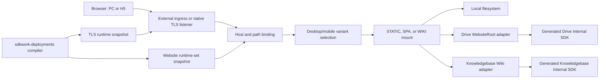

# SDKWork Web Server Production Readiness Review

Status: changes-requested
Owner: SDKWork Web Platform
Reviewed: 2026-07-23
Application: `sdkwork-web`
Risk: critical
Specs: [CODE_REVIEW_SPEC.md](../../../../sdkwork-specs/CODE_REVIEW_SPEC.md),
[QUALITY_GATE_SPEC.md](../../../../sdkwork-specs/QUALITY_GATE_SPEC.md),
[SECURITY_SPEC.md](../../../../sdkwork-specs/SECURITY_SPEC.md),
[DEPLOYMENT_SPEC.md](../../../../sdkwork-specs/DEPLOYMENT_SPEC.md),
[SDKWORK_DEPLOY_SPEC.md](../../../../sdkwork-specs/SDKWORK_DEPLOY_SPEC.md),
[TEST_SPEC.md](../../../../sdkwork-specs/TEST_SPEC.md)

## 1. Review Decision

The Web Server has a verified implementation baseline for local static files, Drive WebsiteRoot,
Knowledgebase Wiki, domain and path routing, PC/H5 variants, development and production runtime
selection, external TLS termination, and native TLS assignment consumption. It is suitable for
continued integration and controlled non-production deployment.

The application is **not approved for commercial production release**. This is a release-gate
decision, not a statement that the implemented data plane is unusable. The remaining blockers are
cross-system capabilities that cannot be truthfully closed inside this repository alone:

1. `sdkwork-deployments` does not yet publish the independent durable TLS lifecycle, authorized
   material distribution, activation observation, or served-fingerprint convergence consumed by
   the implemented Web Node TLS runtime.
2. Drive and Knowledgebase generated Internal SDK methods return complete `Vec<u8>` payloads. The
   provider adapters enforce object ceilings but cannot provide end-to-end response streaming
   without an owner SDK/OpenAPI change.
3. Linux release artifacts and immutable OCI images are not published, signed, or accompanied by
   complete provenance. The application manifest remains `BETA`; all four Linux packages are
   disabled with `releaseBuildDeferred: true`.
4. The `sdkwork-space` application estate is not Deploy-complete: only 7 of 27 present Deploy
   manifests pass the current validator, and 37 repositories with PC and/or H5 roots have no
   Deploy manifest.
5. Production capacity, multi-Node convergence, failure-domain loss, rolling upgrade, rollback,
   Internet/DNS probes, and sustained load/soak evidence remain incomplete.
No exception is granted for these blockers. Production or customer-impacting release still
requires human owner approval under `QUALITY_GATE_SPEC.md`.

The previously reported local-static path-precheck/open TOCTOU blocker is closed. Static delivery
now opens every directory component and the final regular file capability-relative with no-follow
semantics, then streams from the same stable open handle. Windows and Linux evidence is recorded in
section 10. Immutable/read-only roots remain defense in depth.

## 2. Scope And Authorities

This review covers the Web Server consumer and data-plane responsibilities in this repository. It
does not transfer business ownership from Drive, Knowledgebase, or Deploy.

| Concern | Authority | Web Server responsibility |
| --- | --- | --- |
| Application identity and release declaration | `sdkwork.app.config.json` | Declare server identity, profiles, package capability, release channel, and required security evidence. |
| Concrete runtime values | `etc/` and `specs/topology.spec.json` | Bind environment, profile, listener, upstream, assignment source, and recovery paths. |
| Authored local Web Server config | `specs/sdkwork.webserver.config.schema.json` | Validate listeners, virtual hosts, routes, local static roots, upstreams, limits, and TLS selection. |
| Website domain/resource runtime | `specs/sdkwork.website-runtime.descriptor.schema.json` | Consume immutable Deploy-compiled Site/Binding/Variant/Resource/Mount policy. |
| Node Website assignments | `specs/sdkwork.website-runtime-set.snapshot.schema.json` | Consume bounded node/environment-scoped descriptor sets with hash validation and recovery. |
| Node certificate assignments | `specs/sdkwork.tls-runtime.snapshot.schema.json` | Consume independent certificate assignments and activate verified TLS material. |
| Drive publication | Drive WebsiteRoot and generated Drive Internal SDK | Resolve only owner-authorized Space-root or folder-root content. |
| Knowledgebase publication | Knowledgebase Wiki publication and generated Knowledgebase Internal SDK | Resolve only owner-authorized public Wiki routes and content. |
| Application deployment declaration | Each application `deployments/deploy.yaml` | Supply domain, PC/H5 selector, TLS intent, profile, artifact, and topology inputs to Deploy. |
| Deployment compilation and certificate control plane | `sdkwork-deployments` | Compile assignments, authorize material, observe activation, and prove convergence. |

The Web Server must not infer public Drive content from Space visibility, inspect provider storage
topology, invent Knowledgebase routes, edit generated SDK transport, or merge Website and TLS
revision lifecycles.

## 3. Implemented Architecture



Website routing and TLS assignments are independent immutable lifecycles. A Website candidate is
compiled and provider-validated before atomic registry replacement. A TLS candidate is hash-,
scope-, policy-, certificate-, key-, SAN-, lifetime-, and fingerprint-validated before Rustls hot
activation. Each lifecycle has its own A/B last-known-good restart recovery.

## 4. Capability Matrix

| Capability | State | Evidence and boundary |
| --- | --- | --- |
| Local filesystem static/SPA | implemented and verified | `data_plane/static_files.rs`, `data_plane/static_path.rs`, and `data_plane/static_file_response.rs` validate paths, open every directory component and the final regular file capability-relative with no-follow semantics, and stream from the same stable handle. Tests cover Windows and Linux replacement stability, Linux final/intermediate symlink rejection, directory index/redirect, SPA fallback, conditional requests, Range, HEAD, MIME, and bounded large/sparse-file streaming. |
| Deploy compiler to Wiki execution | implemented and verified | `sdkwork-deploy-runtime-compiler/tests/knowledgebase_wiki_delivery_contract.rs` compiles a real Deploy Site/runtime set, activates the exact output in Web, selects desktop/mobile Variants by host/path/device, executes through the Knowledgebase provider/fake generated-SDK boundary, fails private/unpublished routes closed, and observes a live content update with unchanged revision/generation/snapshot. |
| Domain and path routing | implemented and verified | Authored config supports virtual hosts and exact/prefix routes; cloud Website descriptors provide bindings and mounts. Host ambiguity and conflicting routes fail validation. |
| PC/H5 access | implemented and verified | Website descriptors support bounded variants and `CLIENT_CLASS` rules for `DESKTOP`, `MOBILE`, `TABLET`, `TV`, `BOT`, and `OTHER`. Deploy v2 accepts `pc`, `h5`, or both and resolves the corresponding app roots. |
| Development runtime | implemented | `standalone.development` and `cloud.development` topology profiles exist. File assignment sources are restricted to standalone/development use. Development is deliberately not a Deploy v2 production apply profile. |
| Production runtime | implemented with external dependencies | `standalone.production` and `cloud.production` exist; staging/production enforce HTTPS, protected provider origins, provider-event config, and recovery directories. Publication evidence is still missing. |
| Drive Space root | implemented and verified | The Drive adapter accepts an opaque active WebsiteRoot with `sourceRootMode=SPACE_ROOT`; it never maps arbitrary filesystem/object-store locations. |
| Drive folder root | implemented and verified | The same adapter accepts `sourceRootMode=FOLDER`, pins generation and node version, validates eligibility/status/checksum/ETag, and supports Range and conditional requests. |
| Knowledgebase resource | implemented and verified | The Wiki adapter validates canonical active publication, resolves public routes, serves rendered content, and exposes bounded navigation/search provider operations. |
| Generated SDK boundary | compliant | Drive and Knowledgebase calls use owner-generated Internal Rust SDK APIs; no raw HTTP or manual authorization header is introduced. |
| Provider buffered-content admission | implemented and verified | A process-wide weighted semaphore reserves the compiled route's `maximumObjectBytes` before content open, never queues on saturation, and holds the permit through response completion/error/cancellation. Default and Kubernetes value are 256 MiB. This bounds concurrent `Vec<u8>` retention even when metadata is wrong, but is not true streaming. |
| End-to-end provider streaming | blocked | Generated content methods return `Vec<u8>` and the current stream adapters yield that complete buffer once. A generated SDK/OpenAPI response-stream contract is required. |
| Provider resolution cache | implemented and verified | A bounded node-local O(1) LRU caches public static/Wiki resolution metadata, redirects, and non-disclosing negatives using descriptor TTLs. It provides bounded same-key single-flight, positive-only stale-while-revalidate, exact/Provider/type event invalidation, in-flight epoch fencing, and fixed-cardinality Prometheus metrics. Body bytes, credentials, conditional requests, and activation probes are not cached. Shared/edge caching and production load evidence remain open. |
| Provider events | implemented baseline | Loopback ingress authenticates provider/tenant/channel-bound events, enforces canonical Node-qualified Drive callbacks with wrong/missing-Node rejection, validates replay windows and HMAC, keeps bounded concurrency, persists dual-slot checkpoints, handles gap/uncertainty, and invokes reconciliation/invalidation ports. Deploy registers/renews Drive channels but event payloads flow directly from Drive to Web. |
| Website atomic activation | implemented and verified | Node/environment/tenant/hash checks, complete candidate compilation, provider validation, last-known-good retention, stale/conflict rejection, and restart recovery are covered. |
| Static TLS | implemented and verified | PEM size/count, SAN, validity, key match, SNI exact/wildcard, TLS 1.2/1.3 range, ALPN, and handshake behavior are validated. |
| Native TLS assignment runtime | implemented and verified | `tlsRuntime: assignment` consumes a monotonic generation-fenced snapshot and `file:<opaque-version-id>`, confines material to the configured root, validates assignment evidence, atomically reloads Rustls, and retains last-known-good state. |
| Deploy TLS control plane | blocked | Durable ACME/order/challenge/version/assignment/distribution/observation/renewal/revocation and KMS/Vault/CSI authorization are not complete in `sdkwork-deployments`. |
| Kubernetes external TLS | template complete, release unproven | The current template runs non-root with read-only root filesystem, dropped capabilities, probes, resources, immutable digest placeholder, per-Node secret/PVC, topology spread, PDB, and NetworkPolicy. Public TLS terminates at reviewed ingress. |
| Kubernetes native TLS | not deployment-complete | No assignment source or authorized certificate material mount, TLS Service port, TLS readiness state, fingerprint probe, convergence drill, or rollback drill is present in the authored baseline. |
| Linux packages | contract and smoke baseline only | Packaging, bounded archive, SBOM generation, x64/arm64 runtime smoke contracts exist. Manifest packages remain disabled and no publish evidence exists. |
| Commercial operations | not ready | Capacity, alerts/dashboards, support bundle, cache load/eviction/event-storm evidence, multi-Node drills, 100k connections, and 24-hour soak remain release blockers. |

## 5. Configuration Model

### 5.1 Authored Local Web Server Configuration

`sdkwork.webserver.config.schema.json` is the authority for the process-level listener and route
model. The principal objects are:

| Object | Purpose |
| --- | --- |
| `listeners[]` | Bind address, HTTP/1 and HTTP/2 policy, trusted proxy, PROXY protocol, static `tlsPolicyRef`, or dynamic `tlsRuntime: assignment`. |
| `virtualHosts[]` | Hostname ownership and ordered route references. |
| `routes[]` | Exact/prefix routing to static, fixed response, redirect, or reverse-proxy resources. |
| `resources[]` | Local static root, fixed response, redirect, or upstream resource definition. |
| `tlsPolicies[]` | Static certificate/key paths, SNI names, TLS version range, and ALPN. |
| `upstreams[]` | Bounded target pools, health, DNS/SSRF policy, TLS identity, retry, and load balancing. |
| `limits` | Header/body/URI, connection, request, stream, timeout, and resource-pressure ceilings. |

For local static resources, `followSymlinks=true` is rejected by the foundation profile. Runtime
path verification also rejects symlink components, traversal, backslashes, and NUL. Root paths are
deployment values and are not provider publication references.

### 5.2 Website Runtime Descriptor

The immutable `sdkwork.website-runtime.v1` descriptor expresses deployment business intent without
credentials or storage paths:

| Field group | Meaning |
| --- | --- |
| identity | `revisionUuid`, `siteUuid`, `tenantScopeHash`, `environment`, compiler and digest evidence. |
| `bindings[]` | Hostname plus path prefix and serve/redirect action. |
| `variants[]` and `variantRules[]` | PC/H5 or other named variants selected by path or client class. |
| `resources[]` | Opaque `DRIVE` or `KNOWLEDGEBASE` provider reference and required capabilities. |
| `mounts[]` | Variant/path to resource mapping with `STATIC`, `SPA`, or `WIKI` handler and ROOT/ALIAS URL translation. |
| `deliveryPolicy` | Provider timeout, cache policy declaration, stale window, and maximum object bytes. |
| `securityPolicy` | HTTPS enforcement, dot-file denial, and denied path prefixes. |
| `limits` | Bounded counts and path complexity. |
| `observabilityPolicy` | Access log, usage metering, and trace sampling declaration. |

Drive `SPACE_ROOT` versus `FOLDER` selection is provider-owned metadata behind
`providerResourceUuid`; it is not encoded as a host filesystem path. Knowledgebase publication
selection is likewise an opaque provider resource reference.

### 5.3 Website Runtime Set

`sdkwork.website-runtime-set.v1` binds a bounded array of complete Website descriptors to one Node,
environment, generation, compiler version, and SHA-256 digest. Maximum site count is declared and
bounded. Startup and watcher activation reject cross-Node, cross-environment, stale, conflicting,
partial, invalid, or provider-incompatible candidates.

### 5.4 TLS Runtime Snapshot

`sdkwork.tls-runtime.v1` binds certificate versions independently of Website revisions:

| Field | Meaning |
| --- | --- |
| `nodeUuid` | Exact Web Node assignment scope. |
| `assignments[]` | Certificate/version identity, material reference, expected leaf fingerprint, SNI names, validity window, and policy. |
| `materialReference` | Web Server file consumer accepts only `file:<opaque-version-id>` and maps it under the configured material root. |
| `policy` | TLS 1.2/1.3 minimum/maximum and listener-compatible ALPN. |
| `limits` | Maximum assignments and SNI names per assignment. |

The snapshot never contains PEM, private key, absolute path, URL, token, or secret. A material
directory contains immutable `fullchain.pem` and `privkey.pem`; production authorization and mount
ownership belong to Deploy/KMS/secret infrastructure.

## 6. Runtime Environment Variables

| Variable | Purpose | Production rule |
| --- | --- | --- |
| `SDKWORK_WEB_RUNTIME_ASSIGNMENT_SOURCE` | Website source: `cloud` or `file`. | Use `cloud`; file mode is standalone/development only. |
| `SDKWORK_WEB_INTERNAL_API_BASE_URL` | Generated Web Internal SDK origin. | Protected HTTPS, not same-origin. |
| `SDKWORK_WEB_NODE_UUID` | Node assignment identity. | Required and must match snapshots. |
| `SDKWORK_WEB_NODE_TOKEN_FILE` | Web Internal SDK node credential file. | Secret file only; no inline token. |
| `SDKWORK_WEB_WEBSITE_RUNTIME_ENVIRONMENT` | `development`, `test`, `staging`, or `production`. | Must match assignment environment. |
| `SDKWORK_WEB_WEBSITE_RUNTIME_SET_FILE` | Local Website runtime-set source. | File mode only. |
| `SDKWORK_WEB_WEBSITE_RUNTIME_SET_RECOVERY_DIRECTORY` | Website A/B recovery. | Required for staging/production. |
| `SDKWORK_WEB_WEBSITE_TENANT_SCOPE_HASH` | Dedicated fleet tenant scope. | Secret-backed and must match every descriptor. |
| `SDKWORK_WEB_WEBSITE_PROVIDER_BUFFERED_CONTENT_BYTES` | Process-wide admission budget for retained generated-SDK content buffers. | Integer 16 MiB..2 GiB; default/template 256 MiB; capacity evidence required before raising. |
| `SDKWORK_WEB_WEBSITE_PROVIDER_RESOLUTION_CACHE_ENTRIES` | Maximum node-local Provider resolution metadata entries and in-flight slots. | Integer 1..1048576; default/template 16384; capacity evidence required before raising. |
| `SDKWORK_WEB_WEBSITE_PROVIDER_EVENT_CONFIG_FILE` | Provider-event subscriptions and secret-file references. | Required when active resources use Drive/Knowledgebase in staging/production. |
| `SDKWORK_WEBSERVER_DRIVE_INTERNAL_API_BASE_URL` | Generated Drive Internal SDK origin. | Protected HTTPS. |
| `SDKWORK_WEBSERVER_DRIVE_INTERNAL_API_INGRESS_TOKEN_FILE` | Drive provider credential. | Secret file only. |
| `SDKWORK_WEBSERVER_KNOWLEDGEBASE_INTERNAL_API_BASE_URL` | Generated Knowledgebase Internal SDK origin. | Protected HTTPS. |
| `SDKWORK_WEBSERVER_KNOWLEDGEBASE_INTERNAL_API_INGRESS_TOKEN_FILE` | Knowledgebase provider credential. | Secret file only. |
| `SDKWORK_WEB_TLS_RUNTIME_SOURCE` | TLS source: `external` or `file`. | Current Kubernetes baseline uses `external`. |
| `SDKWORK_WEB_TLS_RUNTIME_SNAPSHOT_FILE` | Native TLS assignment snapshot. | Required for file TLS. |
| `SDKWORK_WEB_TLS_MATERIAL_ROOT` | Root of immutable certificate versions. | Required for file TLS; resolved material cannot escape it. |
| `SDKWORK_WEB_TLS_LISTENER_ID` | Listener receiving assignments. | Listener must declare `tlsRuntime: assignment`. |
| `SDKWORK_WEB_TLS_RUNTIME_POLL_INTERVAL_MS` | TLS candidate poll interval. | Bounded to 250..60000 ms. |
| `SDKWORK_WEB_TLS_RUNTIME_RECOVERY_DIRECTORY` | TLS A/B recovery. | Required for staging/production native TLS. |

Concrete examples live in `etc/data-plane/`. `sdkwork.app.config.json` remains identity and release
metadata; it is not a runtime-secret or environment-value authority.

## 7. Deployment Model

### 7.1 PC/H5 And Domains

Every deployable application owns `deployments/deploy.yaml`. Deploy v2 production profiles use
`cloud.production` or `standalone.production`, declare typed deployment dimensions, and place domain
bindings in `expose[]`. A web exposure selects `pc`, `h5`, or both. The validator resolves standard
app roots and rejects missing roots, unsafe production TLS, placeholder upstreams, invalid profile
ids, unknown properties, and plaintext secrets.

Development is selected through application topology and `etc` profiles, not represented as a
side-effecting production Deploy v2 profile. Test and staging Deploy profiles are available for
deployment lifecycle evidence; local development remains a separate non-production workflow.

### 7.2 Web Server Profiles

The Web Server's own `deployments/deploy.yaml` currently validates both profiles:

| Profile | Delivery | Exposure | TLS |
| --- | --- | --- | --- |
| `cloud.production` | Digest-bound container on Kubernetes | Dedicated tenant Website fleet | External ingress termination. |
| `standalone.production` | Signed Linux host package | Private customer-managed host/API | Managed TLS intent. |

The cloud template deliberately starts only the Website delivery edge runtime. Management API
assemblies remain hosted by the platform cloud gateway.

## 8. SDKWork Space Deployment Audit

The audit was run read-only on 2026-07-23 against all sibling `sdkwork-*` directories with the
current SDKWork Deploy validator. Every profile present in each v2 manifest was evaluated.

| Measure | Result |
| --- | ---: |
| SDKWork repositories | 92 |
| Repositories with `sdkwork.app.config.json` | 58 |
| Repositories with `specs/topology.spec.json` | 51 |
| Repositories with `sdkwork.workflow.json` | 47 |
| Repositories with `deployments/deploy.yaml` | 27 |
| Repositories with PC root | 61 |
| Repositories with H5 root | 23 |
| Deploy-valid repositories | 7 |
| Deploy-invalid repositories | 20 |
| PC/H5 repositories without Deploy manifest | 37 |

Deploy-valid repositories are `sdkwork-agents`, `sdkwork-aiot`, `sdkwork-drive`, `sdkwork-im`,
`sdkwork-knowledgebase`, `sdkwork-manager`, and `sdkwork-web-server`.

Deploy-invalid repositories are `sdkwork-agentstudio`, `sdkwork-appstore`, `sdkwork-birdcoder`,
`sdkwork-canvas`, `sdkwork-clawrouter`, `sdkwork-community`, `sdkwork-course`,
`sdkwork-customerservice`, `sdkwork-deployments`, `sdkwork-discovery`, `sdkwork-gameengine`,
`sdkwork-iam`, `sdkwork-mail`, `sdkwork-memory`, `sdkwork-modelkit`, `sdkwork-notes`,
`sdkwork-portal`, `sdkwork-settings`, `sdkwork-skills`, and `sdkwork-voice`. Dominant failures are
legacy/non-standard profile ids, empty profile sets, unknown package names, placeholder upstreams,
missing app roots, and source-tree production without an approved exception.

PC/H5 repositories without a Deploy manifest are `sdkwork-account`, `sdkwork-assets`,
`sdkwork-audio`, `sdkwork-browser`, `sdkwork-cms`, `sdkwork-codebox`, `sdkwork-dezhou`,
`sdkwork-documents`, `sdkwork-doudizhu`, `sdkwork-forum`, `sdkwork-games`,
`sdkwork-generations`, `sdkwork-github`, `sdkwork-image`, `sdkwork-integration`,
`sdkwork-local-router`, `sdkwork-mahjong`, `sdkwork-mall`, `sdkwork-mcp`,
`sdkwork-membership`, `sdkwork-merchandise`, `sdkwork-models`, `sdkwork-music`,
`sdkwork-news`, `sdkwork-notary`, `sdkwork-order`, `sdkwork-payment`, `sdkwork-promotion`,
`sdkwork-prompts`, `sdkwork-rtc`, `sdkwork-search`, `sdkwork-shop`, `sdkwork-terminal`,
`sdkwork-video`, `sdkwork-video-cut`, `sdkwork-web-framework`, and `sdkwork-xiangqi`.

Therefore, the Web Server can consume a standard deployment description, but the requirement to
deploy every `sdkwork-space` project is not satisfied until each application owner supplies and
validates its own authoritative manifest, build output, domain, resource publication, artifact,
approval, and rollback evidence.

## 9. Security And Performance Assessment

Implemented security controls include bounded strict schemas, unknown-field rejection, canonical
URI handling, traversal rejection, capability-relative per-component no-follow static opening,
generated SDK credentials from secret files, protected
production provider origins, tenant-scope binding, constant-time event signature checks, replay and
ordering controls, DNS/SSRF policy, TLS hostname and key validation, non-root Kubernetes execution,
read-only root filesystem, dropped Linux capabilities, probes, resource limits, and NetworkPolicy.

Residual security work includes authorized KMS/Vault/CSI private-key delivery, credential hot
rotation, revocation convergence, disclosure tests for the implemented metadata cache's
revocation/invalidation paths,
multi-tenant credential brokering if shared fleets are introduced, vulnerability/license evidence,
image signing, provenance, public multi-vantage TLS verification, and production controls for
untrusted writers, hard links, and mount changes. Static roots remain immutable and read-only as
defense in depth even though path replacement cannot redirect an already-open response.

Implemented performance controls include bounded configuration cardinality, request/connection/H2
limits, timeouts, upstream admission, health-aware balancing, retries only for safe requests,
resource-pressure shedding, sparse-file local streaming, provider object ceilings, fixed-cardinality
metrics, bounded event concurrency/checkpoints, and non-queueing byte-weighted provider-content
admission held through response completion or cancellation. The 256 MiB default prevents
concurrent maximum-size Drive responses from scaling retained generated-SDK buffers solely with
request concurrency; it does not remove each response's full-buffer allocation.

Residual performance work includes true provider response streaming, production cache
capacity/eviction/event-storm tuning, optional shared/edge body caching, load and soak tests,
per-instance capacity publication, autoscaling evidence, multi-Node failure-domain tests, and the
product targets for 100,000 connections and 24-hour soak.

## 10. Verification Evidence

The current worktree passed the following on 2026-07-23:

```text
cargo check -p sdkwork-api-web-server-standalone-gateway
cargo check -p sdkwork-api-web-server-standalone-gateway --no-default-features
cargo fmt -p sdkwork-webserver-core -p sdkwork-webserver-delivery-runtime -p sdkwork-api-web-server-standalone-gateway -- --check
cargo clippy -p sdkwork-webserver-delivery-runtime -p sdkwork-api-web-server-standalone-gateway --all-targets -- -D warnings
cargo test -p sdkwork-webserver-core
cargo test -p sdkwork-webserver-delivery-runtime --test delivery_executor
cargo test -p sdkwork-api-web-server-standalone-gateway
cargo test -p sdkwork-api-web-server-standalone-gateway --lib
cargo test -p sdkwork-api-web-server-standalone-gateway --test data_plane_integration
docker run --platform linux/amd64 ... cargo test -p sdkwork-api-web-server-standalone-gateway --lib data_plane::static_path::tests -- --nocapture
cargo test -p sdkwork-deploy-runtime-compiler --test knowledgebase_wiki_delivery_contract
pnpm verify
```

Coverage includes core configuration and snapshot contracts; local static file delivery; Drive and
Knowledgebase provider adapters; Website activation/recovery; provider-event authentication,
ordering, checkpointing, and reconciliation; TLS policy, SAN, key, fingerprint, SNI, ALPN, version
range, atomic replacement, corruption recovery, and a real TLS 1.2 SNI handshake; HTTP/1, HTTP/2,
PROXY protocol, trusted proxy, upstream TLS, health, balancing, retries, resource pressure,
operations, and WebSocket behavior.

The focused static-file verification passed 149 library tests and 55 real-listener integration
tests on Windows. The Linux AMD64 container test passed both Unix-specific cases: stable-handle
reads after path replacement and rejection of final/intermediate symlinks. The real-listener test
also proves directory redirect/query preservation, nested index, SPA fallback, single Range,
Last-Modified/If-Modified-Since, and HEAD behavior.

`pnpm verify` also covers workspace Rust tests, API materialization, application composition, API
envelopes, repository docs, script/agent/workflow standards, topology, database framework,
Kubernetes rendering, bounded release archives, CycloneDX SBOM contracts, and cloud development
dry-run. One Windows symlink fixture is platform-skipped by its contract. PostgreSQL lifecycle and
production infrastructure drills require external test environments and are not implied by this
result.

## 11. Required Closure Sequence

The remaining work must follow ownership and review boundaries:

1. Submit a human-reviewed `sdkwork-deployments` DB/API/SDK proposal for independent ACME account,
   order/challenge, immutable certificate version, node assignment, material authorization,
   activation observation, served fingerprint, renewal, rollback, and revocation models.
2. Implement and regenerate Deploy OpenAPI/SDK contracts from the approved proposal; do not hand
   edit generated SDKs and do not embed TLS revisions into Website runtime revisions.
3. Add KMS/Vault/CSI-backed material authorization and mount, native TLS Service/NetworkPolicy,
   readiness state, fingerprint probes, multi-Node convergence, and rollback drills. Keep external
   TLS as the production default until this evidence passes.
4. Extend owner Drive and Knowledgebase OpenAPI/sdkgen contracts with a supported streaming
   response abstraction, regenerate SDKs, and update provider adapters without raw HTTP.
5. Certify the implemented bounded tenant/provider/generation-qualified resolution metadata cache
   with production-shaped capacity, event-storm, eviction, stale/revocation, and multi-Node tests;
   evaluate shared/edge response-body caching as an independent later capability.
6. Bring all application Deploy manifests to v2 and validate every declared profile. Missing
   application-specific domains, resource UUIDs, publication choices, artifacts, and approvals must
   be supplied by their owners rather than guessed centrally.
7. Publish Linux x64/arm64 packages and immutable OCI images from controlled runners with checksum,
   signature, SBOM, provenance, vulnerability/license review, upgrade/rollback, and rollout
   evidence; only then enable package entries and move the app channel out of `BETA`.
8. Run deployed browser-to-resource E2E, public DNS/CDN/TLS probes, load/soak, failure-domain loss,
   multi-Node divergence/recovery, rolling upgrade, rollback, backup/restore, and incident runbook
   exercises.
Steps 1 and 2 involve database migration and public/internal API/SDK contract changes and require
human review before implementation. Enabling production packages or changing release status also
requires real artifact evidence and owner approval; it must not be simulated from a Windows
workstation.

## 12. Final Gate Status

| Gate | Status | Reason |
| --- | --- | --- |
| Ready | passed | Scope, authorities, standards, non-goals, and blockers are explicit. |
| Merge | pending human review | Current code and docs have verification evidence; TLS/config/security changes are high risk. |
| Release | blocked | TLS control plane, provider streaming, production cache/load evidence, artifact publication, fleet evidence, and workspace deployment coverage are incomplete. |
| Exception | none | No standard, security, migration, or release exception is approved. |

This review supersedes any informal statement that the entire Web Server, native TLS deployment,
all `sdkwork-space` projects, or commercial production readiness is complete. Component-level
accepted requirements remain valid within their documented boundaries.
